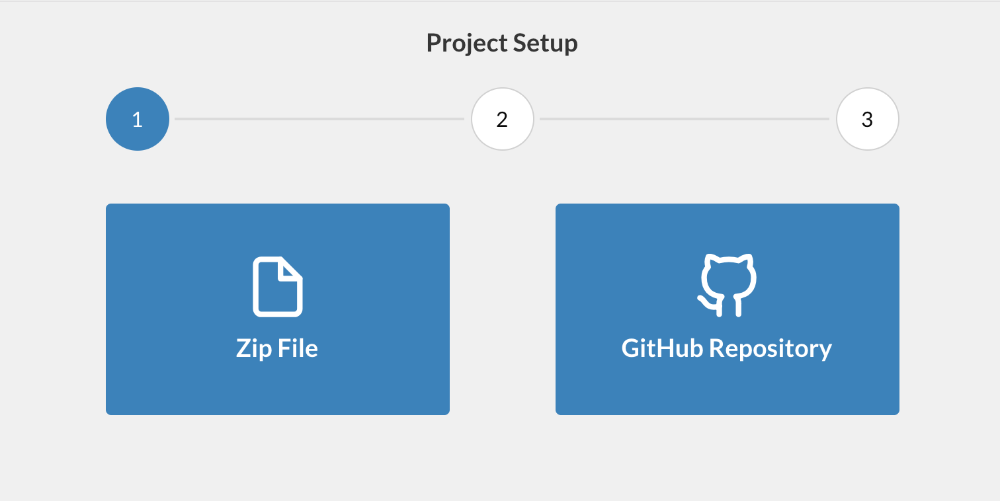
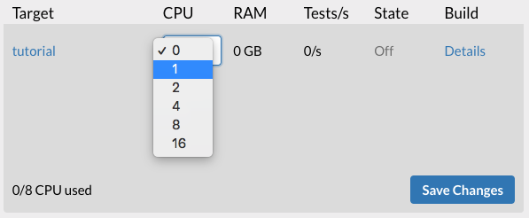
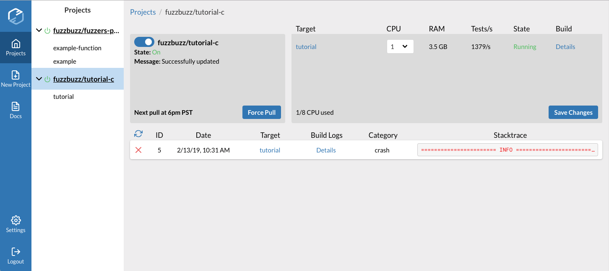

# Catching Bugs

## Step 5: Set up your Project

Head back to [https://app.fuzzbuzz.io](https://app.fuzzbuzz.io), and click the "Create New Project" button. For this tutorial we'll be using the Fuzzbuzz CLI to deploy code directly to the platform, rather than connecting to something like GitHub, which uses webhooks to send updates.



Since we'll use the Fuzzbuzz CLI to deploy code directly, select Zip File as the project type. Give it a name and description, and press create!

## Step 6: Fuzz your code!

To make sure everything is working, run this command from the tutorial directory:

```bash
fuzzbuzz validate
```

You should see that Fuzzbuzz reads the fuzz.yaml and detects the one target we have, called "tutorial". To make sure that all of the setup steps work, we can run:

```text
fuzzbuzz target build tutorial
```

If you head back to [https://app.fuzzbuzz.io](https://app.fuzzbuzz.io), you should see your new project all set up! Give the `tutorial` target 1 CPU to fuzz on, and press "Save Changes".



After a couple of minutes, you should see an entry pop up in the list of bugs. Congratulations - you've just found your first bug with Fuzzbuzz!



Head to the next page to learn how to fix the bug.

This will run the target's setup steps in a local Docker container, using the same environment it would on the Fuzzbuzz platform, so you can make sure everything's set up right. Finally, you can run:

```text
fuzzbuzz target test
```

This will run all of the initial test cases in `corpus/` against the target, to make sure they all pass. If the tests all pass, we're ready to go! Finally, let's push this code to the platform:

```text
fuzzbuzz project update <your-project-name> .
```

