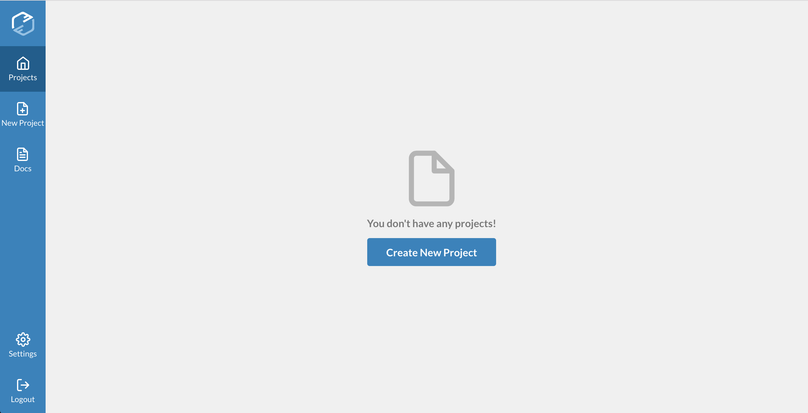

# Installation & Setup

## Step 3: Sign up for Fuzzbuzz


We're currently in closed beta, so you won't be able to create an account for yourself. Want access? Shoot us an email at [contact@fuzzbuzz.io](mailto:contact@fuzzbuzz.io)!


Head to [https://app.fuzzbuzz.io/](https://app.fuzzbuzz.io) and follow the instructions to sign up. Once you see this page, you're all set!



## Step 4: Download the CLI

Fuzzbuzz provides a CLI that makes it easy to build & test your targets locally before pushing code to the platform. It also allows you to reproduce bugs found on the platform, so you can test your fixes immediately.



Use the following command to download the CLI, and then save it somewhere in your path.

```bash
curl -O https://app.fuzzbuzz.io/releases/cli/0.0.1/osx/fuzzbuzz
```



Use the following command to download the CLI, and then save it somewhere in your path.

```bash
wget https://app.fuzzbuzz.io/releases/cli/0.0.1/osx/fuzzbuzz
```



To make sure everything works, run:

```bash
fuzzbuzz auth login
```

If after entering your credentials, you see `Successfully logged in!`, you're all set up. Head to the next page to use the CLI and platform to find and fix your first bug.

